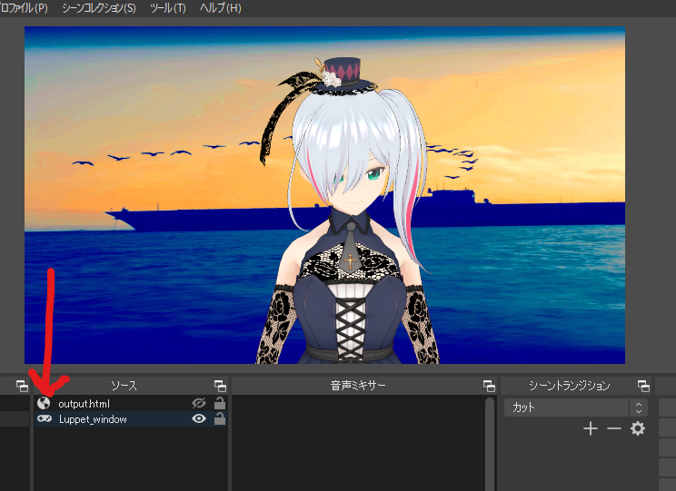
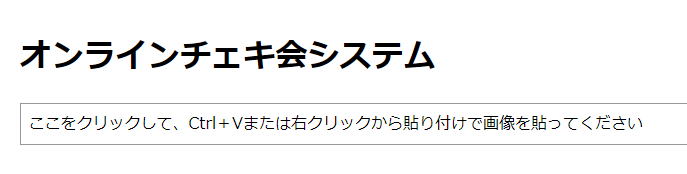
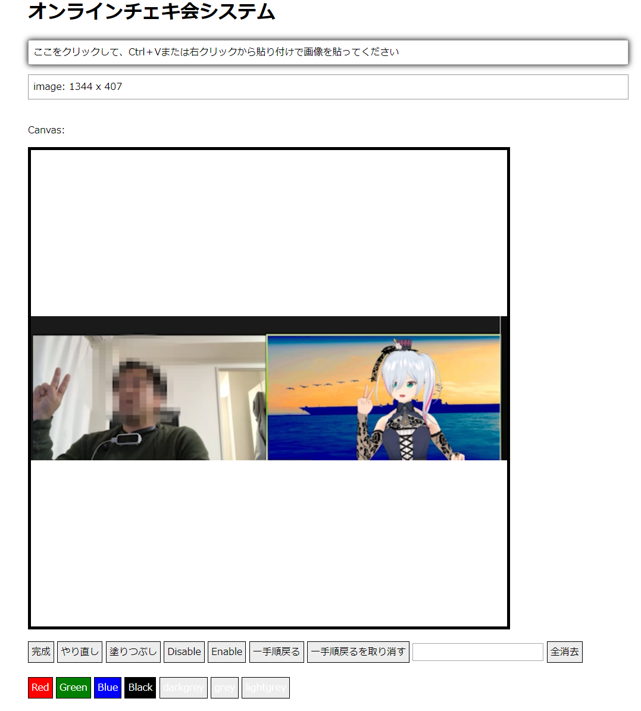
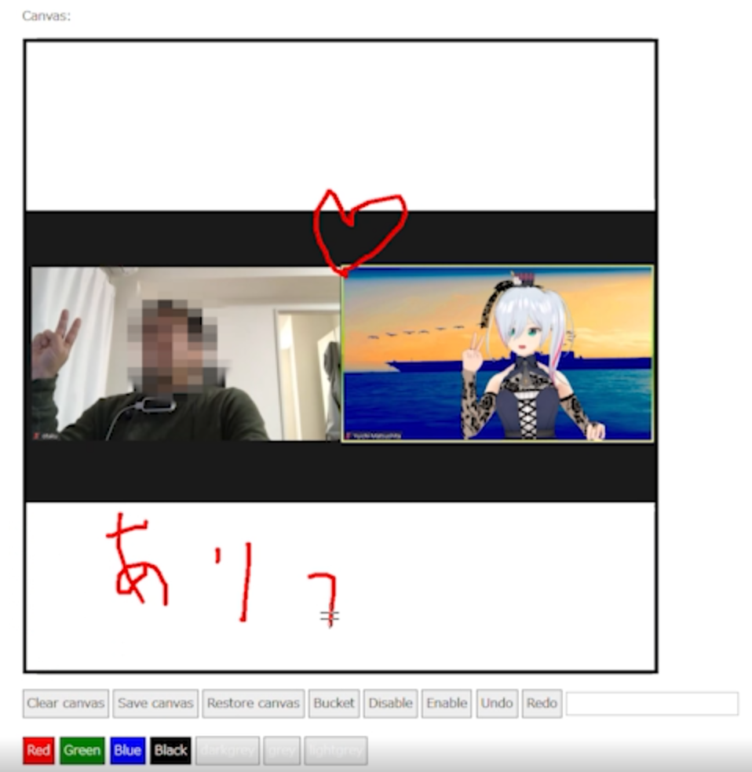

# onlinechekikai
オンラインのサイン会・チェキ会を効率化するためのWebアプリ Support tool for autograph session running in browser

**現状、セキュリティが激甘です。使う時だけサーバーを立てて、サイン会が終わったらサーバーごとオフにする運用を推奨しています**

**Currently, its security is very weak. I recommend setting up the server only when you use it and turning it off after the autograph session is over.**

# インストール方法 How to install

PHPが動くWebサーバーに、このフォルダ構造を保ったままアップロードします。
temppic、signedpic、output.htmlのフォルダ/ファイルは書き込み可能な権限にしておいてください。
あとはindex.htmlをブラウザで読み込めば動きます。

Just put files and folders into your web server which has PHP.
"temppic", "signedpic" folders and "output.html" file must have writeable permissions.
After upload, access to "index.html" on modern browser.

# 使い方 How to use

サインをするタレントは、OBS Virtual camを使って、SkypeやZoomなどのビデオ通話アプリに自分の姿を映している状況を想定しています。
OBSで構成するシーン上に、事前に、https://あなたがインストールしたサーバー/onlinechekikai/output.html をブラウザソースとして読み込んでおいてください。
そして、このブラウザソースは、普段は非表示にしておきます。

ビデオ通話アプリの画面キャプチャーを、OSのクリップボードにコピーします。Windowsの場合はWinキー＋Shift＋Sで、ドラッグした領域をクリップボードにコピーできます。
そして、「ここをクリックして、Ctrl＋Vまたは右クリックから貼り付けで画像を貼ってください」という領域をクリックして `Ctrl+V` または `右クリック→貼り付け` でペースとします。 

すると、canvas領域に、自動的にリサイズされた状態で貼り付けられます。画像の大きさなどによっては、多少時間がかかることがあります。

canvas領域にマウスやペンタブレットで直接、サインの書き込みができます。
色の変更や、閉じた領域を塗りつぶす塗りつぶしツールもあります。

書き終わったら、`完成` ボタンを押します。

すると、output.htmlには、完成した画像のサムネイルと、完成した画像をダウンロードできるQRコードが表示されています。
※output.htmlは標準では1分ごとに自動更新する設定になっているので、すぐには反映されないことがあります。output.htmlのmetaタグ内の数字を変更することで自動更新の間隔を変更できます。

OBSのoutput.htmlを読み込んだブラウザソースを表示して、ファンに見える状態にします。ファンはこのQRコードから、サインを持ち帰ることができます。

紹介動画を作ったので、合わせてご覧下さい。

https://youtu.be/vmbB8DfOUew

プログラムを始めたばかりの初心者が作ったので、フォークしてどんどん自分好みに改変していただけると嬉しいです。